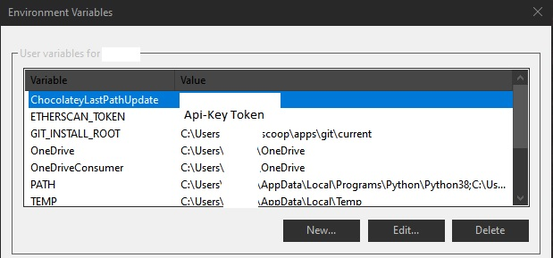

# Tips for installing

## Getting Yearn Exporter Working

### Things you will need

## Infura

* [Infura account to query the blockchain with](https://infura.io/login) 
  * For brownie
  * Make a project and put in the secret and project id after the =
  * Run cmd and type the code below and add in your newly generated keys



```text
set WEB3_INFURA_API_SECRET=
set WEB3_INFRUA_PROJECT_ID=
```



## Prometheus

* [Prometheus](https://prometheus.io/download/)
  * Below is the config you can use to feed Yearn-Exporter into prometheus. This has to have exact spacing or it will throw an error. 



```javascript
# my global config
global:
  scrape_interval:     15s # Set the scrape interval to every 15 seconds. Default is every 1 minute.
  evaluation_interval: 15s # Evaluate rules every 15 seconds. The default is every 1 minute.
  # scrape_timeout is set to the global default (10s).

# Alertmanager configuration
alerting:
  alertmanagers:
  - static_configs:
    - targets:
      # - alertmanager:9093

# Load rules once and periodically evaluate them according to the global 'evaluation_interval'.
rule_files:
  # - "first_rules.yml"
  # - "second_rules.yml"

# A scrape configuration containing exactly one endpoint to scrape:
# Here it's Prometheus itself.
scrape_configs:
  # The job name is added as a label `job=<job_name>` to any timeseries scraped from this config.
  - job_name: 'yearnv2'

    # metrics_path defaults to '/metrics'
    # scheme defaults to 'http'.

    static_configs:
    - targets: ['localhost:8801']
  - job_name: 'yearn'

    # metrics_path defaults to '/metrics'
    # scheme defaults to 'http'.

    static_configs:
    - targets: ['localhost:8800']  
  - job_name: 'prometheus'

    # metrics_path defaults to '/metrics'
    # scheme defaults to 'http'.

    static_configs:
    - targets: ['localhost:9090']

```



## Python

* Python

  * install from [https://www.python.org/downloads/](https://www.python.org/downloads/)

## Brownie

* Check if pip is installed via

```text
C:\> py -m pip --version
pip X.Y.Z from ...\site-packages\pip (python X.Y)
```

If it is not install pip from here [https://pip.pypa.io/en/stable/installing/](https://pip.pypa.io/en/stable/installing/) then

```text
pip install eth-brownie
```

## Etherscan API key

* Make an Etherscan account and [api key](https://etherscan.io/myapikey)
* Add `ETHERSCAN_TOKEN` as a variable in windows under user variables
  * you can either add it manually or alternatively you can run `set ETHERSCAN_TOKEN=yourtokenkey` in cmd
* Make its value your Api-Key Token



## Yearn Exporter - Modifications

* If using Yearn-Exporter on your own computer and not a pre-made docker implementation \(to be released\) then you will need your own Infura Key. This has a 100k request limit and yearn-exporter is currently not optimized for multi-calls as of yet; therefore, you will need to skip some blocks to stay within the free account limits. I have found that sleeping for 250 ms should be sufficient. Modify `yearn.py`as follows.



```python
import warnings, time
```





```python
def exporter_v1():
    prom_gauge = Gauge("yearn", "yearn stats", ["vault", "param"])
    timing = Gauge("yearn_timing", "", ["vault", "action"])
    start_http_server(8800)
    registry = vaults_v1.load_registry()
    # load vaults once, todo: update params
    with timing.labels("registry", "load").time():
        vaults = vaults_v1.load_vaults(registry)
    for block in chain.new_blocks():
        secho(f"{block.number}", fg="green")
        for vault in vaults:
            with timing.labels(vault.name, "describe").time():
                try:
                    info = vault.describe()
                except ValueError as e:
                    print("error", e)
                    continue
            for param, value in info.items():
                # print(f'{param} = {value}')
                prom_gauge.labels(vault.name, param).set(value)
        time.sleep(250)
```





```python
def exporter_v2():
    vault_gauge = Gauge("yearn_vault", "", ["vault", "param"])
    strat_gauge = Gauge("yearn_strategy", "", ["vault", "strategy", "param"])
    timing = Gauge("yearn_timing", "", ["vault", "action"])
    start_http_server(8801)
    for block in chain.new_blocks():
        secho(f"{block.number}", fg="green")
        for vault in vaults_v2.VAULTS:
            secho(vault.name)
            with timing.labels(vault.name, "describe").time():
                info = vault.describe()

            for param, value in info.items():
                if param == "strategies":
                    continue
                vault_gauge.labels(vault.name, param).set(value)

            for strat in info["strategies"]:
                for param, value in info["strategies"][strat].items():
                    strat_gauge.labels(vault.name, strat, param).set(value)
        time.sleep(250)
```



The time.sleep\(\) functions have been added to the exporter\_v1 and v2 methods, along with importing time at the top of the file. You can adjust sleep time to your preference and visit [your infura project dashboard](https://infura.io/dashboard/ethereum) to view how often calls are happening. 

* [Grafana](https://grafana.com/get)
  * After installing go to settings &gt; Data Sources &gt; Add Data Source
  * Select Prometheus
    * URL:  http://yourIPv4address:9090
    * Access: Browser
    * Save and test! Make sure yearn exporter is running and prometheus is also running. If it is working it will show green. 
  * Import pre-made dashboards found [here](https://github.com/DarkGhost7/yearn-exporter-info/tree/main/Dashboards) by + \(create\) &gt; import &gt; upload json file

